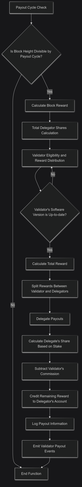
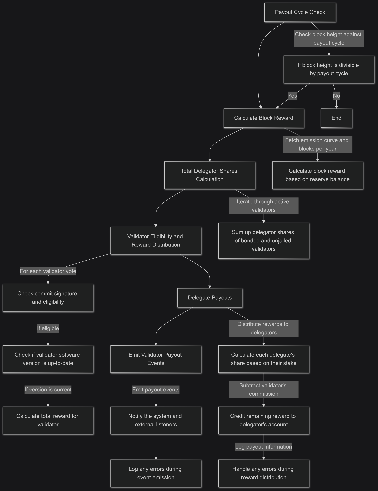

# Validator Payout 

## Current Validator Flow

### How Validator Payout Works Currently?

1. **Payout Cycle Check**: The function begins by checking if the current block height is divisible by the configured payout cycle (`ValidatorPayoutCycle`). If not, the function returns without making any payouts.

2. **Calculate Block Reward**: Fetch the emission curve and the number of blocks per year to calculate the block reward based on the current reserve balance of the system. This reward is distributed proportionally based on validator contributions.

3. **Total Delegator Shares Calculation**: Iterate through the list of active validators who are bonded and not jailed. Sum up their delegator shares to calculate the total shares eligible for the reward distribution.

4. **Validator Eligibility and Reward Distribution**: For each validator vote in the current block:
   - Verify that the validator’s software version is up-to-date with the current version.
   - Calculate the total reward for the validator and split it between the validator and their delegators based on commission rates.

5. **Delegate Payouts**: Distribute rewards to the delegators:
   - Calculate each delegate's share of the reward based on their stake.
   - Subtract the validator's commission from each delegate's reward and credit the remaining reward to the delegator's account.
   - Log payout information and handle any errors during the reward distribution.

6. **Emit Validator Payout Events**: Emit events for each validator payout to notify the system and external listeners of the rewards distribution, logging any errors that occur during event emission.


### Flow 




## New Validator Flow 

1. **Payout Cycle Verification**: The function first checks if the current block height matches the configured payout interval (`ValidatorPayoutCycle`). If the condition isn't met, it exits without distributing payouts.

2. **Block Reward Calculation**: It retrieves the emission curve and the annual block count to determine the block reward based on the current balance of the reserve. This calculated reward is intended for proportional distribution among validators.

3. **Calculation of Total Delegator Shares**: The function iterates through the list of active validators who are bonded and not jailed, summing their delegator shares to calculate the total eligible shares for reward distribution.

4. **Validator Eligibility Check and Reward Allocation**: For each validator that voted in the current block:
   - It checks whether the validator has committed to the block and qualifies for a reward.
   - It verifies that the validator's software version is current and up-to-date.
   - The total reward is then calculated and divided between the validator and their delegators according to the commission rates.

5. **Distribution of Delegate Rewards**: The rewards are distributed to the delegators as follows:
   - Each delegator's share of the reward is calculated based on their stake.
   - The validator's commission is deducted from each delegator's reward, and the remaining amount is credited to the delegator's account.
   - Payout information is logged, and any errors encountered during the reward distribution are managed.

6. **Validator Payout Event Emission**: The function emits events for each validator payout, alerting the system and external observers about the reward distribution, while also logging any errors encountered during the event emission process. 

### Flow 


### Implementation 

Check the vote on validator have signed vote or valid signature 
```go
		for _, vote := range votes {
			if vote.BlockIdFlag.String() != "BLOCK_ID_FLAG_COMMIT" {
				ctx.Logger().Info("validator rewards skipped due to lack of commit signature", "validator", string(vote.Validator.Address))
				continue
			}

```
